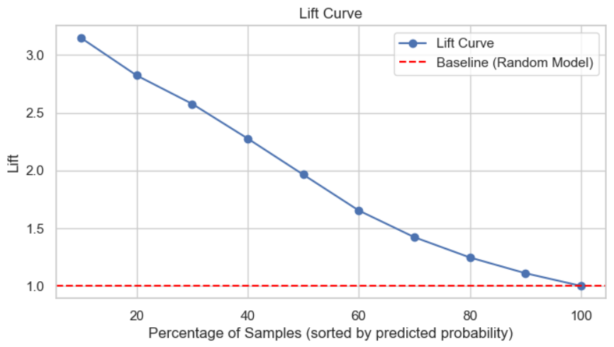
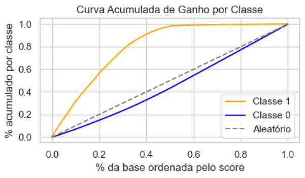
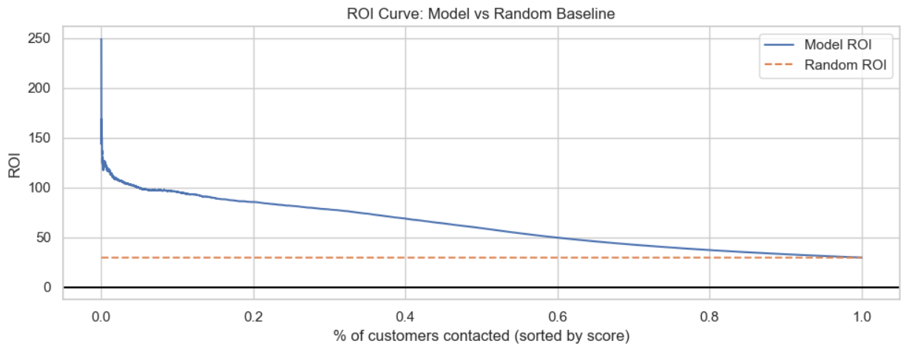
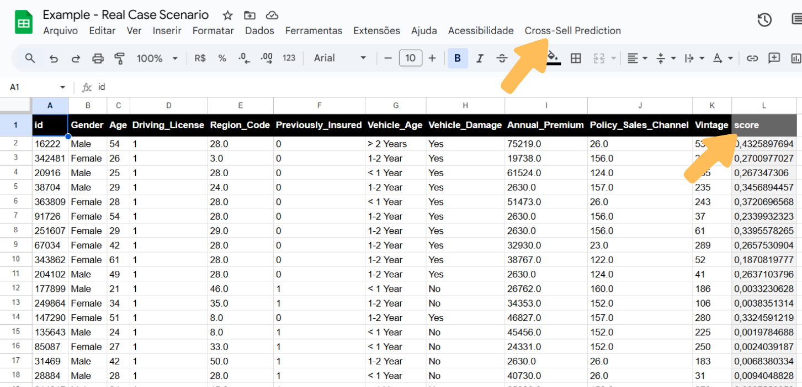

# 🛍️ Cross-Sell Propensity Prediction (Learn to Rank)

Projeto de ponta à ponta de machine learning para a predição da propensão de compra de um novo produto pela base de clientes de uma seguradora (cross-sell). Esse modelo ajudará a equipe comercial a identificar os clientes com maior potencial, economizando tempo e dinheiro.

---

## 🧠 Technologies

- **Language:** Python  
- **Data Processing & Analysis:** Pandas, NumPy  
- **Machine Learning:** Scikit-learn, XGBoost, Random Forest, KNN, Logistic Regression  
- **API Development:** Flask  
- **Deployment & Hosting:** Render  
- **Integration:** Google Apps Script

---

## 🎯 Objective

Criar uma solução que ajude a equipe comercial de uma empresa de seguros de vida a descobrir quais clientes de sua base tem maior **propensão de compra** do novo seguro veicular que querem oferecer. Dessa maneira, o negócio pode:

- Otimizar campanhas de marketing.
- Aumentar taxas de conversão.
- Reduzir custos atingindo a audiência correta.

Além do modelo, criei uma API (Flask) que hospedada (Render) tem seu acesso através da própria planilha de clientes do funcionário (Google Sheets), sendo assim uma solução de fácil adoção pela equipe comercial.

---

## 🏗️ System Architecture
  

---

## 📊 About the Dataset

O dataset contém informações sobre os clientes que já adquiriram seguros dessa empresa e os produtos em si.  
Para dar insumo ao treinamento do modelo, foi realizada uma pesquisa com toda base de clientes perguntando se estariam interessados em adquirir um seguro veicular.  
A partir dessa informação, foi criada uma feature que servirá de label para o treinamento do modelo de ML.

### Data Dictionary

| Column Name              | Description |
|--------------------------|-------------|
| **id**                   | Unique customer ID |
| **gender**               | Customer gender |
| **age**                  | Customer age |
| **region_code**          | Code representing the customer’s region |
| **policy_sales_channel** | Code of the contact channel chosen by the customer |
| **driving_license**      | Indicates if the customer holds a driving license (1 = Yes, 0 = No) |
| **vehicle_age**          | Vehicle age category |
| **vehicle_damage**       | Indicates if the vehicle has been damaged before |
| **previously_insured**   | Whether the customer already owns a car insurance policy |
| **annual_premium**       | Annual insurance premium amount (in currency units) |
| **vintage**              | Number of days the customer has been associated with the health insurance company |
| **response**             | Target variable — whether the customer is interested in purchasing auto insurance (1 = Yes, 0 = No) |


_Source:_ Comunidade DS.

---

## 📂 Project Structure
```
health_insurance_cross_sell
├── data/ # Datasets used for model training and testing
│ ├── api_test_data.json
│ ├── raw.csv
│ ├── train.csv
│ └── test.csv
│
├── notebooks/ # Jupyter notebooks for data exploration and modeling
│ ├── faacc_v1_insurance_cross_sell.ipynb
│ └── final_pipeline.ipynb
│
├── src/ # Source code for data processing and model training
│ ├── init.py
│ ├── insurance_cross_sell.py
│ └── sanitizer.py
│
├── models/ # Serialized ML models and pipelines
│ ├── best_model_pipeline.joblib
│ └── full_pipeline.joblib
│
├── results/ # Model results and evaluation files
│ ├── Example - Real Case Scenario.gsheet
│ └── test.csv
│
├── webapp/ # Web application for model serving / deployment
│ ├── init.py
│ ├── handler.py
│ └── models/ # Production model/pipeline
│   └── full_pipeline.joblib
│
├── requirements.txt # Python dependencies
├── Procfile # Deployment configuration (e.g., for Heroku)
├── .gitignore # Files and folders ignored by Git
└── README.md # Project documentation
```

---

## 🔬 Exploratory Data Analysis (EDA)


---

## 🔧 Feature Engineering

- **is_annual_premium_2630:** foi descoberto que existia uma enorme concentração enorme de observações com o valor de 2630, o que não acontecia com nenhum outro valor, causando um pico anômalo na distribuição mesmo após a aplicação de uma transformação logarítmica (log1p). Para ajudar os algoritmos que poderiam sofrer com isso, foi criada uma nova feature categórica criando um flag para esse valor.
- **is_annual_premium:** após tentar distribuir as observações com o valor dominante citado acima no entorno da mediana da feature (inserindo algum noise para não simplesmene transferir o pico) ainda assim a feature tinha a característica de sua distribuição muito alterada dado que a contagem de observações era esmagadora, então preferi deixar ela como estava e apenas aplicar a função logarítmica para normalizar.
- **gender_age:** as features gender e age foram agrupadas por sexo e em seguida por faixa etária, dado que fazia sentido pensar que determinadas faixas etárias de cada sexo dividiriam bem o espaço de dados.

Durante o processo de modelagem, as variáveis foram transformadas para melhorar o poder preditivo do modelo. Fora utilizados métodos como:

- Log1p
- MinMaxScaler
- RobustScaler
- StandardScaler
- OneHotEncoder
- OrdinalEncoder
- TargetEncoder

Essas transformações foram aplicadas dentro do pipeline do Scikit-learn para garantir consistência durante o deploy e também que não houvesse vazamento de dados nas etapas de feature engineering e treinamento do modelo.

---

## 🤖 Model Selection

Foram testados diferentes algoritmos de classificação:

- Logistic Regression
- KNN
- Random Forest
- XGBoost

O **XGBoost** apresentou o melhor equilíbrio entre *Precision at k* e *Recall at k*.

---

## 📈 Metrics and Results

A principal métrica escolhida foi a **Precision at k**, dado que o principal critério era encontrar numa amostragem de 20% da base ordenada, um alto número de clientes com label positiva.

**Best model:** XGBoost  
  
**Precision at 20%:** 0.3460150869137422  
**Recall at 20%:** 0.5646542496253479  


### Lift Curve
  

A Curva de Lift indica que o modelo é aproximadamente **2,8 vezes mais eficaz** em identificar clientes potenciais nos **20% superiores da base** (ordenada pela probabilidade prevista) do que um modelo aleatório.

### Cumulative Gain Curve
  

A Curva de Ganho Acumulado mostra que, ao contatar apenas **20% dos clientes mais bem classificados pelo modelo**, conseguimos alcançar cerca de **60% dos potenciais clientes reais**. Um modelo aleatório, por outro lado, capturaria apenas cerca de **20%** no mesmo ponto.

### ROI X Baseline Random Model
  

A Curva de ROI mostra que o modelo gera um retorno sobre investimento **muito superior** ao do modelo aleatório, especialmente nos primeiros percentis da base (clientes mais prováveis). No início, o ROI do modelo é **mais de 200% maior** que o baseline, demonstrando alto ganho econômico quando o investimento é direcionado aos clientes mais bem classificados.

---

## 🔍 Insights

- Customers with month-to-month contracts and electronic check payment methods are more likely to churn.
- Longer tenure and automatic payment methods significantly reduce churn risk.
- Contract and payment type were among the most important predictive features.

---

## 💼 Business Impact

O modelo desenvolvido permite que a equipe comercial priorize os **20% de clientes com maior propensão**, resultando em:

- **2.8x mais eficiência** na identificação de clientes potenciais (vs. abordagem aleatória);
- **60% dos clientes interessados** alcançados ao contatar apenas **20% da base**;
- Um **ROI superior a 200%** nos primeiros percentis, demonstrando forte impacto financeiro.

Essa solução é facilmente integrável via planilha do Google Sheets, tornando a adoção imediata e acessível para o time comercial.

---

## 🔗 Google Sheets Integration

  

---

## 🧩 Conclusions and Next Steps

O modelo se provou drasticamente eficiente em comparação com o método atualmente usado.  
A solução será de fácil adoção pela equipe comercial pois foi inserida de maneira natural dentro do seu workflow.  
  
Possíveis melhorias futuras:
- Captação de mais dados dos clientes para criação de features mais relevantes.
- Melhor doumentação de algumas features, que não puderam ser muito bem interpretadas.
- Utilização do SHAP para melhor explicabilidade do modelo.
- Implementação de alguma ferramenta de orquestração para que o modelo tenha boa performance no mundo real.